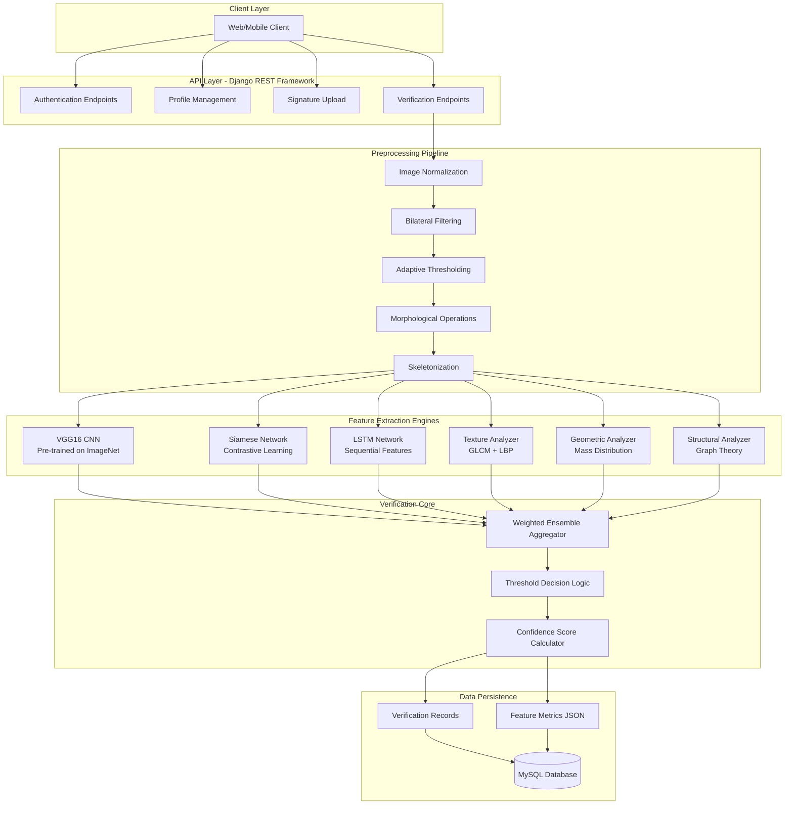

# Hybrid Ensemble Signature Verification System

## Abstract

This project implements a production-ready offline signature verification system using a novel hybrid ensemble approach that synergizes deep learning architectures with classical computer vision techniques. The system achieves robust discrimination between genuine signatures and skilled forgeries through weighted multi-modal feature fusion, combining Convolutional Neural Networks (CNNs), Siamese Networks, Long Short-Term Memory (LSTM) networks, and handcrafted geometric, textural, and structural features. Built on Django REST Framework, the system provides a complete API for signature enrollment, verification, and audit trail management.

## Table of Contents

- [Theoretical Background](#theoretical-background)
- [System Architecture](#system-architecture)
- [Methodology](#methodology)
- [Feature Extraction Pipeline](#feature-extraction-pipeline)
- [Ensemble Aggregation Strategy](#ensemble-aggregation-strategy)
- [API Reference](#api-reference)
- [Installation and Setup](#installation-and-setup)
- [Usage Examples](#usage-examples)
- [Performance Considerations](#performance-considerations)
- [Applications](#applications)
- [Technical Requirements](#technical-requirements)

## Theoretical Background

### Offline Signature Verification as a Biometric Problem

Signature verification is a behavioral biometric authentication method that validates the identity of individuals based on their handwritten signatures. Unlike online signature verification (which captures dynamic features like pen pressure, velocity, and acceleration), **offline signature verification** works with static 2D images of signatures captured from scanned documents or photographs. This presents unique challenges:

1. **Loss of Temporal Information**: Without dynamic stroke data, the system must rely entirely on visual and spatial characteristics
2. **Skilled Forgeries**: Adversaries can practice and replicate visual appearance with high fidelity
3. **Intra-class Variability**: Genuine signatures from the same person exhibit natural variations over time
4. **Inter-class Similarity**: Different individuals may have visually similar signature styles

### Classification Taxonomy

Offline signature verification is fundamentally a **binary classification problem** with two classes:

- **Genuine**: Signatures produced by the authentic owner
- **Forged**: Signatures produced by impostors

Forgeries are further categorized as:
- **Random Forgeries**: Signatures from different individuals (easy to detect)
- **Simple Forgeries**: Attempts without prior knowledge of the genuine signature
- **Skilled Forgeries**: Carefully practiced imitations (most challenging)

This system is optimized to detect skilled forgeries, which represent the primary security threat in real-world applications.

### The Multi-Modal Approach

Traditional approaches rely either on handcrafted features (geometric, statistical, textural) or pure deep learning. However, research demonstrates that **hybrid ensemble methods** achieve superior performance by:

1. **Complementary Information**: Different feature types capture distinct aspects of signature authenticity
2. **Robustness**: Ensemble methods reduce overfitting and improve generalization
3. **Explainability**: Handcrafted features provide interpretable metrics alongside deep learning predictions
4. **Resilience**: If one feature type is compromised (e.g., by sophisticated forgery techniques), other features maintain discriminative power

## System Architecture



### Component Descriptions

**API Layer**: RESTful endpoints built with Django REST Framework, handling authentication, signature enrollment, and verification requests with comprehensive input validation and error handling.

**Preprocessing Pipeline**: Implements a sequence of image processing operations to normalize signatures, remove noise, and prepare images for feature extraction. This ensures consistency across different scanning devices, paper qualities, and lighting conditions.

**Feature Extraction Engines**: Six independent modules that extract complementary feature representations, each specialized for different aspects of signature characteristics.

**Verification Core**: Implements the weighted ensemble aggregation logic and applies the decision threshold to produce binary classification results with confidence scores.

**Data Persistence**: MySQL database storing user profiles, reference signatures, and complete verification history with detailed metrics for auditing and analysis.

## Methodology

### Problem Formulation

Let **S_test** be a test signature image and **R = {S_1, S_2, ..., S_n}** be a set of n reference signatures for a claimed identity. The verification task is to determine:

**V(S_test, R) → {Genuine, Forged}**

This is accomplished through a multi-stage pipeline:

1. **Preprocessing**: Transform both S_test and each S_i in R to normalized binary representations
2. **Feature Extraction**: Compute feature vectors F(S) for each signature
3. **Similarity Computation**: Calculate pairwise similarity scores between F(S_test) and F(S_i)
4. **Ensemble Aggregation**: Combine multiple similarity metrics using learned weights
5. **Decision**: Apply threshold to aggregate score

### Multi-Reference Strategy

When multiple reference signatures are available, the system computes verification against each reference independently and aggregates results using:

- **Maximum Similarity**: Takes the highest similarity score among all references
- **Average Confidence**: Computes mean confidence across all comparisons
- **Majority Voting**: For categorical decisions

This approach improves robustness against natural signature variations and reduces false rejection rates.

## Feature Extraction Pipeline

The system extracts six distinct feature types, each capturing different discriminative characteristics of signatures.

### 1. Convolutional Neural Network Features

**Weight in Ensemble**: Highest (adjustable)

**Architecture**: VGG16 (Visual Geometry Group, 16 layers), pre-trained on ImageNet, truncated at the fifth pooling layer (block5_pool).

**Theoretical Foundation**:
Deep convolutional networks learn hierarchical feature representations through multiple layers of convolution and pooling operations. Lower layers capture low-level features (edges, textures), while deeper layers learn abstract, high-level representations invariant to minor transformations. Transfer learning from ImageNet leverages features learned from millions of natural images, which generalize well to signature verification despite domain differences.

**Implementation Details**:
- Input: Preprocessed binary signature image
- Architecture: 13 convolutional layers + 5 max pooling layers
- Output: 512 feature maps of size 7x7
- Feature Vector: Flattened to 25,088 dimensions
- Similarity Metric: Cosine similarity in high-dimensional space

**Advantages**:
- Captures complex visual patterns
- Robust to small variations (translation, scaling, rotation)
- Effective at detecting macro-level forgery characteristics

### 2. Siamese Network Features

**Weight in Ensemble**: Second highest (adjustable)

**Architecture**: Custom twin convolutional networks sharing identical parameters, trained with contrastive loss.

**Theoretical Foundation**:
Siamese networks are specifically designed for similarity learning tasks. By training the network with pairs of genuine and forged signatures, it learns a metric space where genuine pairs are mapped close together while forged pairs are pushed apart. The contrastive loss function:

**L(y, d) = (1 - y) * 1/2 * d^2 + y * 1/2 * max(margin - d, 0)^2**

where y=0 for genuine pairs, y=1 for forged pairs, and d is Euclidean distance.

**Implementation Details**:
- Input: Two signature images (test and reference)
- Network: Symmetric convolutional architecture
- Training: Contrastive loss with margin parameter
- Output: Feature embeddings in learned metric space
- Similarity: Euclidean distance between embeddings

**Advantages**:
- Specialized for signature verification task
- Detects subtle forgery artifacts (hesitation marks, pen lifts)
- Learns task-specific discriminative features

**Model File**: `siamese_model.keras` (104.5 MB)

### 3. Long Short-Term Memory (LSTM) Features

**Weight in Ensemble**: Moderate (adjustable)

**Architecture**: Recurrent neural network designed to process sequential signature features.

**Theoretical Foundation**:
While signatures are static images, they can be decomposed into sequential representations by traversing the signature skeleton, analyzing strokes in order, or scanning in grid patterns. LSTMs excel at learning temporal dependencies and can capture the sequential nature of signature production even from static images.

**Feature Extraction Methods**:
The system employs an **ImprovedSignaturePreprocessor** that extracts 128 timesteps with 16 features per timestep:

1. **Skeleton Traversal**: Traces the signature skeleton path, extracting features along the trajectory
2. **Grid-Based Scanning**: Divides signature into spatial cells and analyzes sequentially
3. **Stroke-Based Features**: Processes connected components as sequential strokes
4. **Pressure/Thickness Simulation**: Uses distance transforms to estimate stroke thickness variations

**Similarity Calculation**:
Multi-metric fusion combining:
- Cosine similarity (captures angular alignment)
- Euclidean similarity (measures distance magnitude)
- Feature correlation (statistical relationship)
- Average feature similarity (element-wise comparison)
- Prediction similarity (model output comparison)

**Advantages**:
- Captures sequential stroke patterns
- Detects inconsistencies in signature flow
- Complements spatial features from CNNs

**Model Files**:
- `improved_lstm_model.keras` (4.8 MB)
- `LSTM.keras` (17.4 MB - original version)
- `improved_lstm_model_scaler.pkl` (StandardScaler for normalization)

### 4. Texture Features

**Weight in Ensemble**: Lower (adjustable)

**Theoretical Foundation**:
Texture analysis quantifies the spatial distribution of pixel intensities, capturing fine-grained surface characteristics like ink density, paper grain, and stroke smoothness. Genuine signatures exhibit consistent texture patterns, while forgeries often show irregularities from hesitation or unnatural pen movements.

**Methods Implemented**:

**a) Gray-Level Co-occurrence Matrix (GLCM)**
- Computes second-order statistical texture features
- Analyzes spatial relationships between pixel pairs
- Parameters: Multiple distances [1, 2] and angles [0°, 45°, 90°, 135°]
- Properties extracted:
  - **Contrast**: Local intensity variations
  - **Dissimilarity**: Absolute difference between neighboring pixels
  - **Homogeneity**: Closeness of distribution to diagonal
  - **Energy**: Uniformity of texture
- Output: 16-dimensional feature vector

**b) Local Binary Patterns (LBP)**
- Encodes local texture by comparing each pixel with its neighbors
- Method: Uniform LBP with radius=2, neighbors=16
- Creates rotation-invariant texture descriptors
- Output: 14-bin histogram

**Similarity Metrics**:
Combines multiple statistical distance measures:
- Jensen-Shannon divergence
- Chi-square distance
- Bhattacharyya distance
- Total variation distance

Uses power scaling (exponent 2.5) to amplify small differences, increasing discriminative power.

**Advantages**:
- Detects micro-level texture inconsistencies
- Robust to illumination changes
- Captures ink flow characteristics

### 5. Geometric Features

**Weight in Ensemble**: Lower (adjustable)

**Theoretical Foundation**:
Geometric features capture the spatial layout and proportions of signatures. These include aspect ratios, mass distribution, stroke directions, and complexity measures. Geometric features are highly interpretable and provide explainable verification decisions.

**Feature Categories** (20 total dimensions):

**a) Signature Envelope Analysis**:
- Width-to-height ratio
- Aspect ratio
- Bounding box properties

**b) Mass Distribution (6 features)**:
- Signature divided into left, middle, and right thirds
- Computes ratio of ink pixels in each zone
- Captures horizontal weight distribution

**c) Stroke Direction Analysis (3 features)**:
- Horizontal, diagonal, and vertical stroke tendencies
- Direction entropy (randomness measure)
- Computed using gradient magnitude and orientation

**d) Signature Complexity (3 features)**:
- Perimeter-to-area ratio (measures intricacy)
- Number of connected components (stroke count)
- Component size variation (coefficient of variation)

**e) Spatial Frequency (3 features)**:
- Horizontal and vertical density variation
- Character-like peak detection

**f) Geometric Moments (3 features)**:
- Statistical shape descriptors
- Invariant to translation and scale

**g) Density Measures (2 features)**:
- Overall ink density
- Density distribution uniformity

**Similarity Metric**:
Weighted absolute differences with aggressive power scaling (exponent 3.0) to emphasize geometric discrepancies.

**Advantages**:
- Human-interpretable features
- Captures overall signature layout
- Effective for detecting crude forgeries

### 6. Structural Features

**Weight in Ensemble**: Lower (adjustable)

**Theoretical Foundation**:
Structural analysis treats signatures as graph structures by reducing them to skeletons (1-pixel-wide representations). Graph-theoretic properties like node degree, connectivity, and topology provide discriminative features invariant to minor variations but sensitive to structural differences.

**Methods Implemented**:

**a) Skeletonization**:
- Morphological thinning to extract signature medial axis
- Preserves topological structure while removing thickness variations

**b) Graph Analysis**:
- **Endpoints**: Pixels with exactly one neighbor (stroke terminals)
- **Junctions**: Pixels with three or more neighbors (branching points)
- **Loops**: Closed connected components

**c) Feature Categories** (15 total dimensions):
- **Density Distribution (6 features)**: Spatial distribution of skeleton pixels
- **Topology Features (4 features)**: Connectivity patterns, Euler number
- **Branch Analysis (5 features)**: Branch lengths, angles, distributions

**Similarity Metric**:
Weighted normalized differences between structural feature vectors.

**Advantages**:
- Invariant to stroke thickness
- Captures topological signature properties
- Detects structural inconsistencies in forgeries

## Ensemble Aggregation Strategy

### Weighted Fusion Model

The final verification decision is based on a weighted linear combination of individual feature similarities:

**S_final = w1*S_cnn + w2*S_siamese + w3*S_lstm + w4*S_texture + w5*S_geometric + w6*S_structural**

where:
- **S_i**: Normalized similarity score for feature type i (range [0, 1])
- **w_i**: Weight for feature type i
- **Σw_i = 1** (weights sum to unity)

### Weight Assignment Rationale

Weights are assigned based on empirical performance evaluation and discriminative power:

1. **CNN Features**: Highest weight - demonstrates superior generalization and robustness
2. **Siamese Features**: Second highest - specialized for signature verification task
3. **LSTM Features**: Moderate weight - effective but occasionally inconsistent
4. **Texture Features**: Lower weight - captures fine details but sensitive to scanning artifacts
5. **Geometric Features**: Lower weight - interpretable but limited discriminative power alone
6. **Structural Features**: Lower weight - topology useful but insufficient independently

The weights are **tunable parameters** that can be adjusted based on:
- Dataset characteristics
- Forgery sophistication level
- Application-specific requirements (precision vs. recall trade-off)
- Computational resource constraints

### Decision Threshold

**Threshold Value**: Empirically optimized (default: 0.587)

The threshold is selected to balance two error types:
- **False Rejection Rate (FRR)**: Genuine signatures incorrectly classified as forged
- **False Acceptance Rate (FAR)**: Forged signatures incorrectly classified as genuine

**Decision Rule**:
```
if S_final >= threshold:
    classification = GENUINE
else:
    classification = FORGED
```

The threshold can be adjusted based on application security requirements:
- **High-security applications** (banking, legal): Lower threshold (prioritize low FAR)
- **User-convenience applications**: Higher threshold (prioritize low FRR)

## Preprocessing Pipeline

Robust preprocessing is critical for invariant feature extraction. The pipeline implements:

### 1. Grayscale Conversion
Reduces color images (BGR) to single-channel grayscale, eliminating irrelevant color information.

### 2. Bilateral Filtering
```
Bilateral(I, d, sigmaColor, sigmaSpace)
```
- **Purpose**: Edge-preserving noise reduction
- **Mechanism**: Weights pixels based on spatial distance AND intensity similarity
- **Advantage**: Removes Gaussian noise while maintaining sharp stroke edges

### 3. Adaptive Thresholding
```
Threshold = Otsu's Method (automatic threshold selection)
```
- **Purpose**: Binarization (separates ink from background)
- **Otsu's Method**: Maximizes inter-class variance between foreground and background
- **Robustness**: Adapts to varying illumination and contrast

### 4. Morphological Operations

**a) Morphological Closing**:
```
Close(I) = Dilate(Erode(I))
```
- Fills small holes and gaps in strokes
- Reconnects broken signature segments

**b) Morphological Opening**:
```
Open(I) = Erode(Dilate(I))
```
- Removes small noise artifacts
- Smooths signature boundaries

### 5. Skeletonization
- **Purpose**: Reduces signature to 1-pixel-wide representation
- **Usage**: Exclusively for structural feature extraction
- **Preservation**: Maintains topological properties (connectivity, loops)

### 6. Boundary Detection and Cropping
- Identifies signature region using contour detection
- Crops to tight bounding box
- Removes excess white space

### 7. Normalization
- Resizes to standard dimensions (width=720px, aspect ratio preserved)
- Ensures consistent scale across all signatures

## API Reference

### Authentication Endpoints

#### Register User
```http
POST /api/auth/register/
Content-Type: application/json

{
  "username": "string",
  "password": "string",
  "email": "string"
}

Response: 201 Created
{
  "user": {...},
  "token": "auth_token_string"
}
```

#### Login
```http
POST /api/auth/login/
Content-Type: application/json

{
  "username": "string",
  "password": "string"
}

Response: 200 OK
{
  "token": "auth_token_string",
  "user_id": integer
}
```

### Profile Management

#### Create User Profile
```http
POST /api/profiles/
Authorization: Token <auth_token>
Content-Type: application/json

{
  "name": "string",
  "id_number": "string"
}

Response: 201 Created
{
  "id": integer,
  "name": "string",
  "id_number": "string",
  "created_at": "datetime"
}
```

#### List All Profiles
```http
GET /api/profiles/
Authorization: Token <auth_token>

Response: 200 OK
[
  {
    "id": integer,
    "name": "string",
    "id_number": "string",
    "signature_count": integer
  },
  ...
]
```

#### Get User's Reference Signatures
```http
GET /api/profiles/{id}/signatures/
Authorization: Token <auth_token>

Response: 200 OK
[
  {
    "id": integer,
    "image": "url",
    "uploaded_at": "datetime",
    "notes": "string"
  },
  ...
]
```

### Signature Management

#### Upload Reference Signature
```http
POST /api/signatures/
Authorization: Token <auth_token>
Content-Type: multipart/form-data

{
  "user_profile": integer,
  "image": file,
  "notes": "string" (optional)
}

Response: 201 Created
{
  "id": integer,
  "user_profile": integer,
  "image": "preprocessed_url",
  "uploaded_at": "datetime"
}
```

Note: Images are automatically preprocessed before storage.

### Verification Endpoints

#### Verify Signature (Primary Endpoint)
```http
POST /api/verify/
Authorization: Token <auth_token>
Content-Type: multipart/form-data

{
  "user_profile_id": integer,
  "test_signature": file,
  "save_to_references": boolean (optional)
}

Response: 200 OK
{
  "result": "genuine" | "forged",
  "confidence": float (0.0 to 1.0),
  "threshold": 0.587,
  "verification_metrics": {
    "cnn_similarity": float,
    "siamese_similarity": float,
    "lstm_similarity": float,
    "texture_similarity": float,
    "geometric_similarity": float,
    "structural_similarity": float
  },
  "reference_count": integer,
  "processing_time_ms": float,
  "verification_id": integer
}
```

#### Retrieve Verification History
```http
GET /api/verification-records/
Authorization: Token <auth_token>

Response: 200 OK
[
  {
    "id": integer,
    "user_profile": {...},
    "result": "genuine" | "forged",
    "confidence": float,
    "verification_metrics": {...},
    "verified_at": "datetime"
  },
  ...
]
```

#### Add Verified Signature to References
```http
POST /api/verification-records/{id}/add_to_references/
Authorization: Token <auth_token>

Response: 200 OK
{
  "message": "Signature added to references",
  "signature_id": integer
}
```

Note: Only signatures verified as "genuine" can be added to references.

## Installation and Setup

### Prerequisites
- Python 3.8 or higher
- MySQL Server 5.7 or higher
- pip (Python package installer)
- 4GB+ RAM (for TensorFlow model loading)
- 2GB+ disk space (for pre-trained models)

### Step 1: Clone Repository
```bash
git clone https://github.com/khatri90/signature-verification-backend.git
cd signature-verification-backend
```

### Step 2: Create Virtual Environment
```bash
# Create virtual environment
python -m venv venv

# Activate (Windows)
venv\Scripts\activate

# Activate (Linux/Mac)
source venv/bin/activate
```

### Step 3: Install Dependencies
```bash
pip install -r requirements.txt
```

**Core Dependencies**:
- Django 5.2 (Web framework)
- Django REST Framework 3.14+ (API toolkit)
- TensorFlow 2.10+ (Deep learning models)
- OpenCV 4.7+ (Image processing)
- scikit-image 0.19+ (Advanced image algorithms)
- NumPy 1.22+ (Numerical computing)
- SciPy 1.10+ (Scientific computing)
- Mahotas 1.4+ (Computer vision algorithms)
- mysqlclient 2.1+ (MySQL database connector)

### Step 4: Configure MySQL Database
```bash
# Login to MySQL
mysql -u root -p

# Create database
CREATE DATABASE signature_verification CHARACTER SET utf8mb4 COLLATE utf8mb4_unicode_ci;

# Create user (optional, for production)
CREATE USER 'sigverify_user'@'localhost' IDENTIFIED BY 'your_password';
GRANT ALL PRIVILEGES ON signature_verification.* TO 'sigverify_user'@'localhost';
FLUSH PRIVILEGES;
```

### Step 5: Environment Configuration
Create `.env` file in project root:
```ini
SECRET_KEY=your_django_secret_key_here
DB_NAME=signature_verification
DB_USER=root
DB_PASSWORD=your_mysql_password
DB_HOST=localhost
DB_PORT=3306
DEBUG=True
ALLOWED_HOSTS=localhost,127.0.0.1
```

Generate Django secret key:
```bash
python -c "from django.core.management.utils import get_random_secret_key; print(get_random_secret_key())"
```

### Step 6: Database Migrations
```bash
# Create migration files
python manage.py makemigrations

# Apply migrations
python manage.py migrate

# Create superuser (for admin panel)
python manage.py createsuperuser
```

### Step 7: Verify Model Files
Ensure pre-trained models are present in `models/` directory:
- `siamese_model.keras` (104.5 MB)
- `improved_lstm_model.keras` (4.8 MB)
- `LSTM.keras` (17.4 MB)
- `improved_lstm_model_scaler.pkl`

### Step 8: Run Development Server
```bash
python manage.py runserver
```

Access the application at: `http://localhost:8000`

Admin panel: `http://localhost:8000/admin`

### Step 9: API Testing
```bash
# Test server health
curl http://localhost:8000/api/

# Register user
curl -X POST http://localhost:8000/api/auth/register/ \
  -H "Content-Type: application/json" \
  -d '{"username": "testuser", "password": "testpass123", "email": "test@example.com"}'
```

## Usage Examples

### Python Client Example
```python
import requests

# Base URL
BASE_URL = "http://localhost:8000/api"

# 1. Register and login
response = requests.post(f"{BASE_URL}/auth/register/", json={
    "username": "john_doe",
    "password": "secure_password",
    "email": "john@example.com"
})
token = response.json()["token"]

# 2. Create user profile
headers = {"Authorization": f"Token {token}"}
profile_response = requests.post(f"{BASE_URL}/profiles/",
    headers=headers,
    json={"name": "John Doe", "id_number": "ID12345"}
)
profile_id = profile_response.json()["id"]

# 3. Upload reference signatures
for signature_path in ["sig1.png", "sig2.png", "sig3.png"]:
    with open(signature_path, "rb") as f:
        files = {"image": f}
        data = {"user_profile": profile_id, "notes": "Reference signature"}
        requests.post(f"{BASE_URL}/signatures/",
            headers=headers,
            files=files,
            data=data
        )

# 4. Verify test signature
with open("test_signature.png", "rb") as f:
    files = {"test_signature": f}
    data = {"user_profile_id": profile_id}
    verify_response = requests.post(f"{BASE_URL}/verify/",
        headers=headers,
        files=files,
        data=data
    )

# 5. Display results
result = verify_response.json()
print(f"Result: {result['result'].upper()}")
print(f"Confidence: {result['confidence']:.2%}")
print(f"\nDetailed Metrics:")
for metric, value in result['verification_metrics'].items():
    print(f"  {metric}: {value:.4f}")
```

### JavaScript/Fetch API Example
```javascript
const BASE_URL = 'http://localhost:8000/api';

// Login
async function login(username, password) {
    const response = await fetch(`${BASE_URL}/auth/login/`, {
        method: 'POST',
        headers: {'Content-Type': 'application/json'},
        body: JSON.stringify({username, password})
    });
    const data = await response.json();
    return data.token;
}

// Verify signature
async function verifySignature(token, profileId, signatureFile) {
    const formData = new FormData();
    formData.append('user_profile_id', profileId);
    formData.append('test_signature', signatureFile);

    const response = await fetch(`${BASE_URL}/verify/`, {
        method: 'POST',
        headers: {'Authorization': `Token ${token}`},
        body: formData
    });

    const result = await response.json();
    console.log('Verification Result:', result.result);
    console.log('Confidence:', (result.confidence * 100).toFixed(2) + '%');

    return result;
}
```

### cURL Example
```bash
# Login
TOKEN=$(curl -X POST http://localhost:8000/api/auth/login/ \
  -H "Content-Type: application/json" \
  -d '{"username":"admin","password":"admin123"}' \
  | jq -r '.token')

# Verify signature
curl -X POST http://localhost:8000/api/verify/ \
  -H "Authorization: Token $TOKEN" \
  -F "user_profile_id=1" \
  -F "test_signature=@/path/to/signature.png" \
  | jq
```

## Performance Considerations

### Computational Complexity

**Time Complexity**:
- Preprocessing: O(n) where n = number of pixels
- CNN Feature Extraction: O(1) - fixed architecture
- Siamese Network: O(1) - fixed architecture
- LSTM Processing: O(t) where t = sequence length (128)
- Texture Features: O(n log n) - GLCM computation
- Geometric Features: O(n) - image traversal
- Structural Features: O(n) - skeletonization

**Overall per-verification**: Approximately 0.5-2 seconds (depending on reference count)

**Space Complexity**:
- Model Storage: ~127 MB (all pre-trained models)
- Runtime Memory: ~1.5 GB (TensorFlow + model loading)
- Per-image Processing: ~10 MB (feature vectors + intermediates)

### Optimization Strategies

1. **Model Loading**: Pre-load all models at server startup (avoid per-request loading)
2. **Batch Processing**: Process multiple verifications concurrently using task queues (Celery)
3. **Caching**: Cache preprocessed reference signatures to avoid redundant processing
4. **GPU Acceleration**: Utilize CUDA-enabled GPUs for CNN/Siamese/LSTM inference
5. **Feature Vector Database**: Store pre-computed reference features in database

### Scalability

**Horizontal Scaling**:
- Stateless API design enables load balancing across multiple servers
- Shared MySQL database with connection pooling
- Redis cache for session management and feature vectors

**Vertical Scaling**:
- Multi-core CPU utilization for parallel feature extraction
- GPU memory for batch inference
- SSD storage for faster model loading

## Applications

### Banking and Financial Services
- Check signature verification
- Credit card authorization
- Loan document authentication
- Account opening procedures

### Legal and Governmental
- Contract validation
- Witness signature verification
- Passport/visa applications
- Voter registration authentication

### Healthcare
- Prescription verification
- Patient consent forms
- Medical record authentication
- Insurance claim validation

### Corporate and Enterprise
- Document approval workflows
- Contract signing verification
- Time sheet authentication
- Audit trail compliance

### Education
- Examination authentication
- Transcript verification
- Enrollment form validation
- Certificate issuance

## Future Enhancements

### Algorithmic Improvements
1. **Attention Mechanisms**: Incorporate visual attention layers to focus on discriminative signature regions
2. **Transformer Architectures**: Replace LSTM with Transformer encoders for better sequential modeling
3. **Meta-Learning**: Few-shot learning approaches for verification with limited reference samples
4. **Adversarial Training**: Generate synthetic forgeries to improve model robustness

### System Features
1. **Real-time Verification**: WebSocket-based streaming for instant feedback
2. **Mobile SDK**: Native iOS/Android libraries for on-device verification
3. **Blockchain Integration**: Immutable audit trails for verification records
4. **Multi-factor Authentication**: Combine signature verification with other biometrics

### Explainability
1. **Saliency Maps**: Visualize which signature regions influenced the decision
2. **SHAP Values**: Quantify contribution of each feature type to final prediction
3. **Confidence Calibration**: Provide uncertainty estimates with predictions

### Performance
1. **Model Quantization**: Reduce model size and inference time using INT8 quantization
2. **Knowledge Distillation**: Train smaller student models from ensemble
3. **Edge Deployment**: TensorFlow Lite models for mobile/embedded devices

## Technical Requirements

### Minimum System Requirements
- **OS**: Windows 10+, Ubuntu 18.04+, macOS 10.14+
- **CPU**: Intel Core i5 (4 cores) or equivalent
- **RAM**: 4 GB
- **Storage**: 5 GB available space
- **Python**: 3.8+
- **MySQL**: 5.7+

### Recommended System Requirements
- **OS**: Ubuntu 20.04 LTS (server deployment)
- **CPU**: Intel Xeon / AMD EPYC (8+ cores)
- **RAM**: 16 GB
- **GPU**: NVIDIA GPU with CUDA 11.2+ (optional, for acceleration)
- **Storage**: 20 GB SSD
- **Python**: 3.10+
- **MySQL**: 8.0+

### Production Deployment
For production environments, consider:
- **Web Server**: Gunicorn + Nginx reverse proxy
- **Process Manager**: Supervisor or systemd
- **Task Queue**: Celery with Redis broker
- **Monitoring**: Prometheus + Grafana
- **Logging**: ELK Stack (Elasticsearch, Logstash, Kibana)
- **Security**: SSL/TLS certificates, rate limiting, input sanitization

## License

This project is provided for academic and research purposes.

## References

1. Hafemann, L. G., Sabourin, R., & Oliveira, L. S. (2017). "Offline handwritten signature verification — Literature review." *2017 Seventh International Conference on Image Processing Theory, Tools and Applications (IPTA)*.

2. Diaz, M., Ferrer, M. A., Impedovo, D., et al. (2019). "A perspective analysis of handwritten signature technology." *ACM Computing Surveys*, 51(6), 1-39.

3. Simonyan, K., & Zisserman, A. (2014). "Very Deep Convolutional Networks for Large-Scale Image Recognition." *arXiv preprint arXiv:1409.1556*.

4. Bromley, J., Guyon, I., LeCun, Y., et al. (1994). "Signature verification using a 'Siamese' time delay neural network." *International Journal of Pattern Recognition and Artificial Intelligence*, 7(04), 669-688.

5. Hochreiter, S., & Schmidhuber, J. (1997). "Long short-term memory." *Neural Computation*, 9(8), 1735-1780.

## Contact and Support

For issues, questions, or contributions, please visit the GitHub repository or contact the development team.

**Repository**: https://github.com/khatri90/signature-verification-backend
