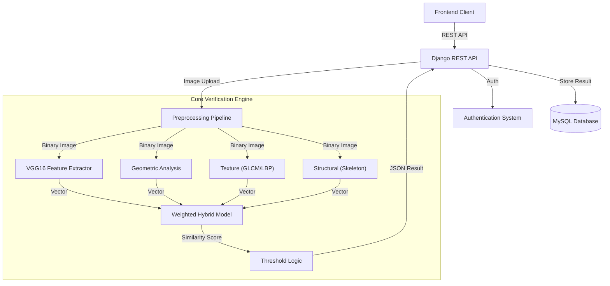

# Signature Verification System - Backend API

A high-performance Django REST Framework backend for offline signature verification. This system implements a **Hybrid Ensemble Verification Model**, combining Deep Learning (CNNs, Siamese Networks) with advanced computer vision techniques to distinguish genuine signatures from forgeries with high accuracy.

## System Architecture



## Technical Deep Dive

The verification core operates on a weighted ensemble strategy, aggregating multiple high-dimensional similarity metrics. The system is tuned to a discrimination threshold of **0.587**.

### 1. Feature Extraction Pipeline

#### A. Deep Learning Features (CNN) - Weight: 65%
-   **Model**: VGG16 (ImageNet weights), truncated at `block5_pool`.
-   **Logic**: Extracts abstract, high-level visual representations robust to minor scaling and rotation variations.
-   **Output**: 512x7x7 feature tensor, flattened and normalized.

#### B. Similarity Learning (Siamese) - Weight: 25%
-   **Architecture**: Custom Siamese Convolutional Network trained with Contrastive Loss.
-   **Logic**: Computers Euclidean distance between feature vectors of the test signature and reference signatures in a learned metric space.
-   **Purpose**: Specialized for detecting subtle forgery artifacts (shaky strokes, hesitation marks).

#### C. Handcrafted Features - Weight: 10%
Traditional computer vision algorithms provide explainable metrics:
1.  **Texture Analysis (GLCM & LBP)**:
    -   Uses **Gray-Level Co-occurrence Matrix** to measure contrast, homogeneity, and energy.
    -   Uses **Local Binary Patterns** to detect fine-grained surface textures and ink flow irregularities.
2.  **Geometric Analysis**:
    -   Calculates aspect ratios, centroid position, and mass distribution across grid zones.
    -   Analyzes signature envelope and stroke density.
3.  **Structural Analysis**:
    -   **Skeletonization**: Reducse signature to 1-pixel wide paths.
    -   **Graph Theory**: Counts stroke endpoints, junctions (branching points), and loops.

### 2. Preprocessing Pipeline
Before feature extraction, every image undergoes rigorous normalization:
1.  **Grayscale Conversion**: Reduces dimensionality.
2.  **Bilateral Filtering**: Removes Gaussian noise while preserving stroke edges.
3.  **Adaptive Thresholding**: Binarizes the image to separate ink from background.
4.  **Morphological Operations**: Closing/Opening to fill small holes and reconnect broken strokes.
5.  **Skeletonization**: Used specifically for structural feature extraction.

### 3. Verification Logic
The `Weighted Hybrid Model` computes a final similarity score ($S_{final}$) using the formula:

$$ S_{final} = \sum (S_i \times W_i) $$

Where $S_i$ is the similarity score of feature $i$ and $W_i$ is its weight.
-   If $S_{final} \ge 0.587$: **Genuine**
-   If $S_{final} < 0.587$: **Forgery**

## API Reference

### Authentication
-   `POST /api/auth/login/`
-   `POST /api/auth/register/`

### Signature Management
-   `GET /api/signatures/`: Retrieve authenticated user's signatures.
-   `POST /api/signatures/`: Upload a new reference signature.

### Verification
-   `POST /api/verify/`
    -   **Input**: `test_signature` (File), `user_profile_id` (Int).
    -   **Output**: Detailed verification report including individual feature scores.

## Installation & Setup

1.  **Clone the Repository**
    ```bash
    git clone https://github.com/khatri90/signature-verification-backend.git
    cd signature-verification-backend
    ```

2.  **Install Dependencies**
    ```bash
    pip install -r requirements.txt
    ```

3.  **Configure Environment**
    Create `.env`:
    ```ini
    SECRET_KEY=your_production_secret
    DB_PASSWORD=your_database_password
    ```

4.  **Initialize Database**
    ```bash
    python manage.py makemigrations
    python manage.py migrate
    ```

5.  **Run Application**
    ```bash
    python manage.py runserver
    ```

## Requirements
-   Python 3.8+
-   MySQL System
-   TensorFlow 2.10+
-   OpenCV Contrib
